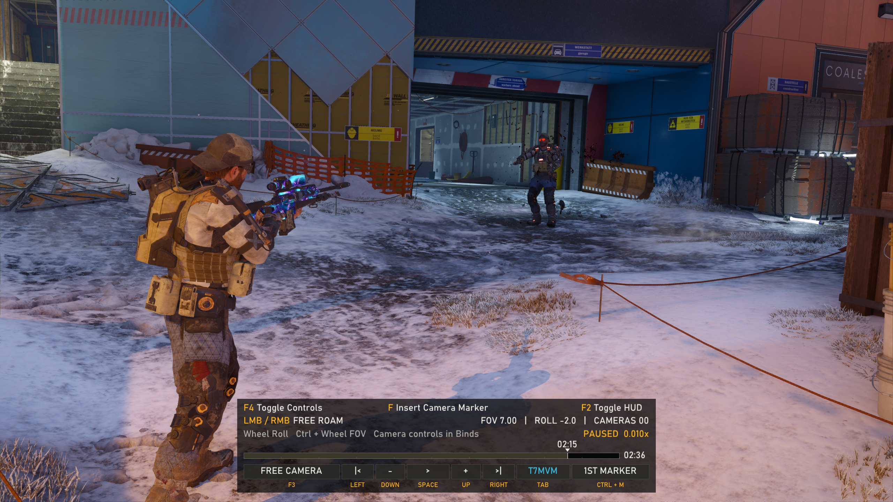
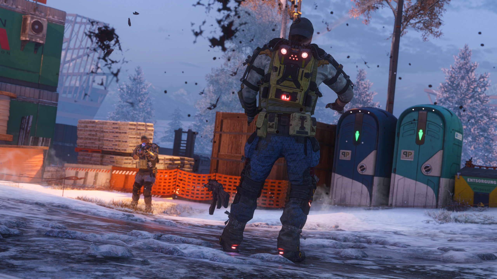
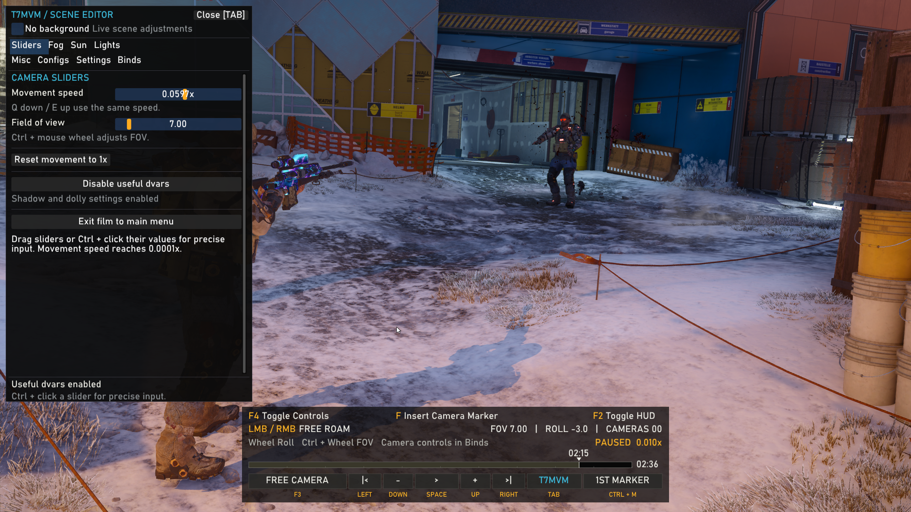
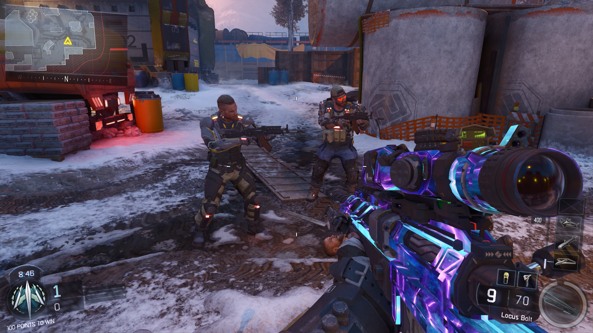
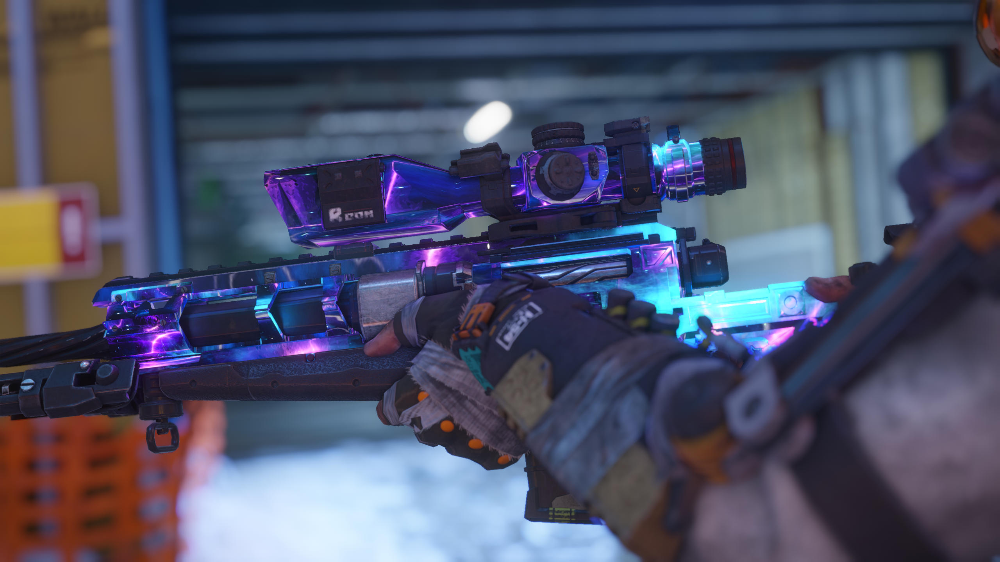

# BoiiiMVM

**[Watch the 40-second installation video](docs/video/how-to-install.mp4). Launch `boiii.exe`, not `BlackOps3.exe`. If the “BOIII Patch Installer” prompt appears, press Cancel.** The theater UI needs the supported `BlackOps3.exe` build; the bot menu can work even when the theater plugin rejects a different game build. See the [compatibility check](docs/INSTALL.md#theater-ui-still-shows-the-original-controls).

Keyboard-first cinematic tools and a bot setup for **Call of Duty: Black Ops III** on Windows. The package combines the BOIII bot mod with a theater overlay for building camera paths, changing the scene, and recording video directly from the game.

BO3's native theater interface was designed around controller-style navigation. On a keyboard, moving through its transport controls and dolly options with arrow keys makes precise editing slow. This project keeps BO3's film and camera-marker system, then adds direct binds, a readable timeline, and a mouse-driven settings panel.

## Download and install

Download **`BoiiiMVM-v0.8.1.zip`** from [Releases](https://github.com/serv7/BoiiiMVM/releases/latest). GitHub provides the repository source code beneath the release assets. You need your own installed copy of BO3; the game itself is not included.

1. Close BOIII and back up your current `boiii.exe`, `boiii` folder, and `%LOCALAPPDATA%\boiii\data` if they exist.
2. Open the ZIP. Copy `boiii.exe`, `boiii`, and `MVM` into the folder containing your own `BlackOps3.exe`. Merge folders and replace the supplied client/plugin files.
3. Copy the ZIP's `boiii\data` folder to `%LOCALAPPDATA%\boiii\data`, merging it with any existing runtime data. The copy left under the game folder is harmless; the client reads the AppData copy.
4. **Launch the bundled `boiii.exe`, not `BlackOps3.exe`**, from your BO3 folder with `-noupdate` so this compatible build stays in place. If BOIII offers to download a different `BlackOps3.exe`, **press Cancel**. Start a private custom game to use the bot mod. To use the cinematic tools, open a saved multiplayer theater film through BOIII.

The runtime ZIP has only four items at its top level: `boiii/`, `MVM/`, `boiii.exe`, and `README.md`. Read [the detailed install and troubleshooting guide](docs/INSTALL.md) before replacing an existing BOIII setup.

The theater plugin checks functions in `BlackOps3.exe` and leaves the original theater controls active if they do not match. The tested executable has SHA-256 `66B95EB4667BD5B3B3D230E7BED1D29CCD261D48CA2699F01216C863BE24FF44`. Pressing Cancel at BOIII's prompt does not make a different executable compatible; compare the hash and logs if the bot mod works but the theater UI does not.

## Quick start

In a private custom game, press **Insert** for the bot menu and **middle mouse** to spawn a bot where you aim. Pick a specialist, body/head skin, weapon, and camo in the menu. Save or load your position with **H/J**.

In a theater film, press **F3** until you reach Free Camera. Move to different film times, position the camera, and press **F** at each point. With at least two markers, click **left mouse** for Dolly Camera. **Tab** opens the scene editor, **F5** starts or stops video recording, and **F4** hides the replacement controls for a clean shot.

Read the full [bot-mod tutorial](docs/BOT-MOD.md) and [cinematic/theater tutorial](docs/THEATER.md) for every feature and default bind.

## Theater controls

These defaults can be changed in **Tab → Binds**. Bot-mod binds are changed in **Insert → Keybinds**.

| Key | Action |
| --- | --- |
| F2 | Toggle gameplay HUD |
| F3 | Cycle first person → third person → free camera |
| Q / E in free camera | Move down / up at the selected camera movement speed |
| Left mouse in free camera | Enter dolly playback (two or more cameras) |
| Right mouse in free camera | Enter camera-editing mode |
| F in free camera | Place a camera or edit the camera aimed at |
| F while repositioning | Apply the new camera position |
| F4 | Hide or show the replacement theater controls |
| Mouse wheel in free camera | Roll the camera |
| Ctrl + mouse wheel | Change field of view |
| L | Delete all cameras in the film |
| Left / right arrows | Seek backward / forward (5 seconds by default) |
| Up / down arrows | Increase / decrease film timescale (0.01×–10×) |
| Ctrl + M | Jump to the first camera and enter Dolly Camera |
| Space | Pause or play |
| Tab | Open or close the scene editor and release the mouse |
| F5 | Start or stop video recording |
| Escape / F10 | Close the panel, or open the exit-film confirmation |

The bottom HUD shows current and total film time, markers, playback speed, camera mode, FOV, and roll. It can be hidden independently from the gameplay HUD. The dolly position follows a curved path through the markers; BO3 retains control of camera orientation.

## Scene editor and recording

The left-side Tab panel keeps most of the picture visible while you adjust it. **Sliders** covers ultra-slow free-camera movement, FOV, the reversible “useful dvars” toggle, and leaving the film. **Fog**, **Sun**, **Lights**, and **Misc** expose live color, lighting, visibility, exposure, sky, weapon, and playback controls. **Configs** saves and loads scene CFGs. **Settings** contains recording and control options. **Binds** reassigns the theater controls.

Recording is video-only. Choose 1–240 fps and ProRes 4444, ProRes 422 HQ, or lossless FFV1 in Settings. Press F5 to start or stop; videos are written to `MVM\Theater\recordings`. If ReShade's add-on callback is available, the recorder captures the picture after its effects and before this overlay. The bundled FFmpeg files power encoding. See [the theater tutorial](docs/THEATER.md) for marker editing, CFGs, fog presets, lighting, and recording details.

## Gallery

| Bot setup | Cinematic close-up |
| --- | --- |
|  |  |

More examples: [aiming shot](docs/images/aiming-cinematic.png) and [bot close-up](docs/images/bot-closeup.png).

## Credits and source

- **[@luslex on X](https://x.com/luslex)** created the original BOIII bot mod this project builds on: its Insert menu, middle-mouse bot spawning, and bot specialist/skin/weapon/camo controls. The bundled GSC scripts extend that setup for this combined build.
- [Ezz-lol/boiii-free](https://github.com/Ezz-lol/boiii-free) is the upstream BOIII client. This project includes a customized executable and does not include BO3 game files.
- The theater plugin uses ImGui, MinHook and kiero sources from the user-supplied reMVM-t7 tree, plus the ReShade add-on API and FFmpeg. See [credits and licenses](docs/CREDITS.md).

The repository contains the theater plugin and bot GSC source, along with their build dependencies. Download it using GitHub's “Source code” links on the release. The original @luslex bot-menu executable was supplied as a binary, and its menu source was not supplied; the upstream BOIII source is linked above. See [building from source](docs/BUILD.md) for the scope of the available source.

This project is intended for private custom games and cinematic work. It has been tested with the BO3 executable identified in the release README; other builds may not match the plugin's native-function checks.
