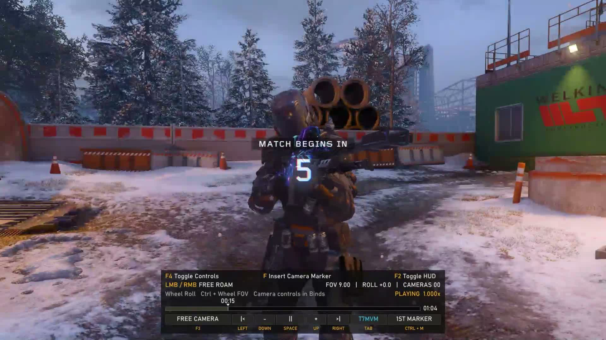
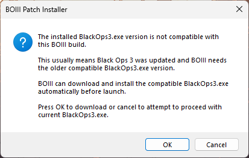

# Installation and first run

**[Watch the installation video](video/how-to-install.mp4)** before copying files. The crucial launch steps are to run the supplied **`boiii.exe`, not `BlackOps3.exe`**, and press **Cancel** if the BOIII Patch Installer offers to download a different game executable.

## Requirements

You need Windows 10/11 x64 and your own installed copy of Call of Duty: Black Ops III. This download does not include the game. It includes a customized BOIII client, the bot scripts, the theater plugin, BOIII runtime data, and FFmpeg for video recording. ReShade is optional and is not bundled.

1. Download `BoiiiMVM-v0.8.1.zip` from the repository's Releases page. Extract it to a temporary folder. You should see exactly `boiii`, `MVM`, `boiii.exe`, and `README.md`.
2. Close the game and BOIII. Back up the `boiii.exe` and `boiii` folder already in the same folder as your `BlackOps3.exe`. Also back up `%LOCALAPPDATA%\boiii\data` if present. Preserve your personal configs, recordings, and film files.
3. Copy the extracted `boiii.exe`, `boiii` folder, and `MVM` folder into the folder containing `BlackOps3.exe`. Merge folders and replace the supplied files. Do not copy the enclosing ZIP folder.
4. Open `%LOCALAPPDATA%\boiii` using Win+R. Copy `boiii\data` from the extracted ZIP into that location so the result is `%LOCALAPPDATA%\boiii\data`. Merge with the backup as needed. BOIII reads these runtime UI assets from AppData.
5. **Launch the supplied `boiii.exe`, not `BlackOps3.exe`,** from the BO3 game folder with `-noupdate` to keep this compatible build in place. If the **BOIII Patch Installer** says your installed `BlackOps3.exe` version is incompatible and offers to download another one, **press Cancel** to continue with your current executable. Do not press OK for this setup: it can replace the executable the theater plugin was built against. Use a private custom match for the bot mod or load a saved multiplayer film for the theater tools.

Pressing **Cancel** only skips BOIII's offered replacement. It cannot make a different `BlackOps3.exe` compatible with this theater plugin. Check the version below if the native controls remain.

The bot menu opens with **Insert** in a private custom match. The theater HUD appears at the bottom of a film and **Tab** opens the scene editor. See [Bot mod](BOT-MOD.md) and [Theater](THEATER.md).

## Theater UI still shows the original controls

The bot mod and theater UI load through different parts of the client. A working Insert bot menu does **not** establish that the theater DLL loaded or that the game executable matches. Check these in order:

1. Confirm you launched the supplied `boiii.exe` from the BO3 folder, with `-noupdate`, and pressed **Cancel** on the BOIII Patch Installer prompt. Do not use the game's `BlackOps3.exe` shortcut for this setup.
2. Confirm `boiii\plugins\bo3_theater.dll` exists under the game folder. Its release SHA-256 is `369EE3412B7E7C6950431039FBF8E282CA5A6454347286F0672482A47B8C61FC`. Avoid `-noplugins`, and remove a duplicate theater DLL from `%LOCALAPPDATA%\boiii\plugins` if one exists.
3. In PowerShell, opened in the game folder, run `(Get-FileHash .\BlackOps3.exe -Algorithm SHA256).Hash`. This theater build was verified against `66B95EB4667BD5B3B3D230E7BED1D29CCD261D48CA2699F01216C863BE24FF44`. If the hash differs, the plugin's native-function checks may reject that version; copying the same ZIP again will not fix it.
4. Read `boiii_players\plugins.log` for `BO3 Theater Keyboard UI 0.8.1`, then `MVM\theater.log`. `Plugin loaded` means the DLL started. `Build mismatch at RVA` or `BOIII native-call proxy mismatch` explains why it kept the original theater UI. `Exact game build verified; theater backend enabled` followed by `D3D11 UI initialized` means the plugin reached its UI hooks. If `MVM\theater.log` was never created, investigate plugin loading before game-build compatibility.

If you ask for help, provide the two log files, your game and plugin SHA-256 values, and whether the BOIII Patch Installer appeared. Avoid sharing the game executable itself.

## Other troubleshooting

If recording fails, confirm `MVM\Theater\ffmpeg.exe` and all its adjacent DLLs were extracted. Look in `MVM\Theater\recordings\ffmpeg-last.log`. If ReShade effects do not appear, confirm you installed a compatible add-on-enabled ReShade and that its effects are active in-game. The capture falls back to the game image when the post-effects callback is unavailable.

If the bot menu does not appear, confirm `boiii\custom_scripts\mp\botmod.gsc` and `botmod_ai.gsc` are installed, that you launched the bundled client, and that you are hosting a private custom game.

To restore your prior setup, close BOIII, remove `boiii\plugins\bo3_theater.dll`, and restore the client, scripts, and runtime data from your backups. Removing only the theater DLL restores BO3's native theater UI while leaving the other customized client files in place.
